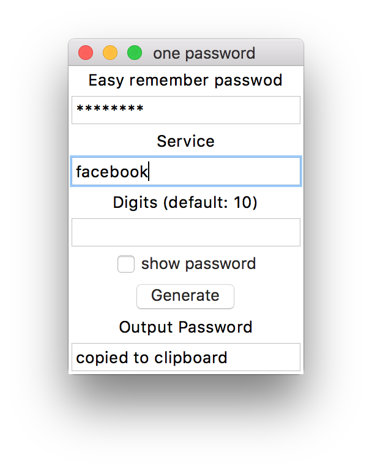

# One Password
This is a cross-platform, simplified version of one password, user only need to remember one password, and generate different passwords for each service.

## Prebuild GUI App
There are some prebuild GUI apps from gui.py.  
These apps are built from pyinstaller.

### OSX
[Download from NTU space](https://www.space.ntu.edu.tw/navigate/s/61089A648A504B3C9632C6DD5EBB84A1QQY)  

### Windows
[Download from NTU space](https://www.space.ntu.edu.tw/navigate/s/96F4918037EE4D7D8467D3C7BC2F6FE4QQY)

## How to use
There are two interfaces to use this project.

### Command line Interface (cli)

	pyton3 one_password.py
	
### GUI

	python3 gui.py

or double click the gui.py  
The GUI program will automatically copy password to your clipboard, so you can paste it easily **ctrl + v** or **command + v**

## Hash
This project use sha256 to hash the password and service you enter, then output as base64 string, for base64 contains upper cases, lower cases and numbers.

## License
This project is published under GPLv3.