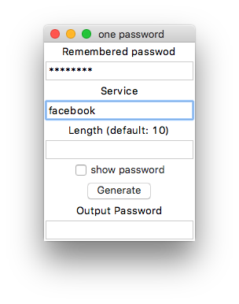

# One Password
This is a cross-platform, simplified version of one password, user only need to remember one password, and generate different passwords for each service.

## Web Interface
[Demo](http://homepage.ntu.edu.tw/~r04921056/)  
  
There is also a web interface, since all password calculation is at local, even not useing https, your password is still safe.  
After calculating your password, the output password will be copied into your clipboard.  
This function has been tested on iphone with safari.  
You can run your own one password server, all of the web source code is in 'web' folder.

## Prebuild GUI App
There are some prebuild GUI apps from gui.py.  
These apps are built from pyinstaller.

### OSX
[Download from NTU space](https://www.space.ntu.edu.tw/navigate/s/93507095E8F340F8AB20C86D96443E7BQQY)  
sha256sum: aee707942b4cc2bfc791ecfecfc0a042f40ab3b23f8f2a73eeea208bd24e3296

### Windows
[Download from NTU space](https://www.space.ntu.edu.tw/navigate/s/070517334C9440B9B3E653A7E84ED268QQY)  
sha256sum: 7d7d51bd62a5f00d2400e964316bbf9f07357bd9f0dab2a80e613881889250f5

## How to use
There are two interfaces to use this project.

### Command line Interface (cli)

	pyton3 one_password.py
	
### GUI

	python3 gui.py

or double click the gui.py  
The GUI program will automatically copy password to your clipboard, so you can paste it easily **ctrl + v** or **command + v**

## Hash
This project use sha256 to hash the password and service you enter, then output as base64 string, for base64 contains upper cases, lower cases and numbers.

## License
This project is published under GPLv3.